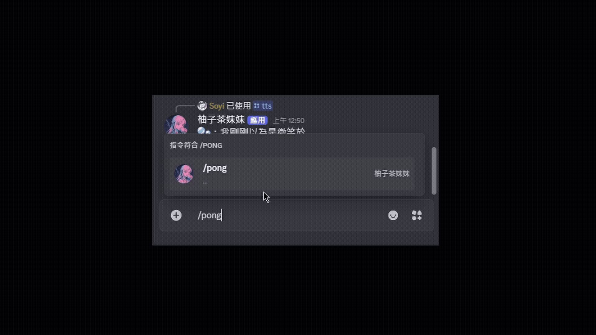

# discord-bot-pomelo-tea

一個基於 Discord API 的多功能機器人專案，以 Cog 模組化設計，方便功能封裝與後續二次開發。

## Demo 功能展示

### 🎮 Pong

### 🧠 vlrt_pro

## 特點

- **Docker 封裝**：整合所有依賴與環境設定，方便快速部署與移植。
- **Docker Compose 配置**：支援 GPU 加速（NVIDIA GPU，需安裝 NVIDIA Container Toolkit）。
- **模組化 Cog 架構**：利用 discord.py 的 Cog 系統封裝功能，利於團隊協作與擴充。

## 環境需求

- **平台**：x86 架構  
- **LLM 功能特別需求**：  
  - CUDA 12.8  
  - NVIDIA GPU（VRAM ≥ 8GB）  
  - RAM ≥ 32GB  

## 開發與部署環境（範例）

- 作業系統：Windows 11 (WSL2 + Docker for Desktop)  
- CPU：Intel i7-13700F 2.1GHz  
- GPU：NVIDIA RTX4070  
- 記憶體：32GB RAM  

## 軟體技術架構
- **核心**：大部分功能基於 Discord API (discord.py) 開發  
- **模組化**：採用 Cog 做功能封裝，每個 Cog 可獨立管理命令和事件，方便功能拆分與維護  

其中 `vlrt_pro` 生成式功能使用到將 LLM 部署於本地的機台。以下為軟體框架說明：
`vlrt_pro`：
  - 使用 Ollama 框架串接 `llama3-8b` 模型  
  - 利用 Langchain 建構 Retrieval Augmented Generation (RAG) 檢索問答系統  
  - 採用 FAISS 進行本地向量庫檢索，向量嵌入使用 HuggingFace 的 `sentence-transformers/all-MiniLM-L6-v2`  
  - 內含 Valorant Pro Settings 來自 [prosettings.net](https://prosettings.net/lists/valorant/) 的資料庫  
  - 查詢時，Prompt 指定回覆使用繁體中文，且嚴格限定回答格式與內容  
